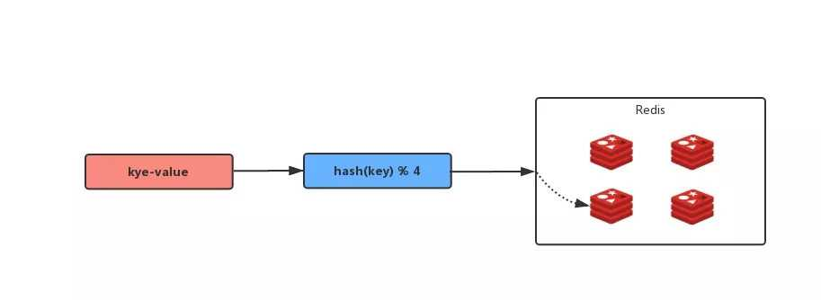
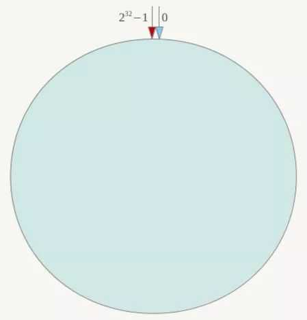
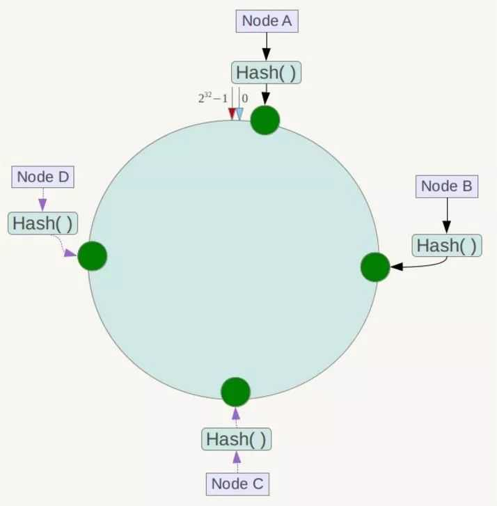
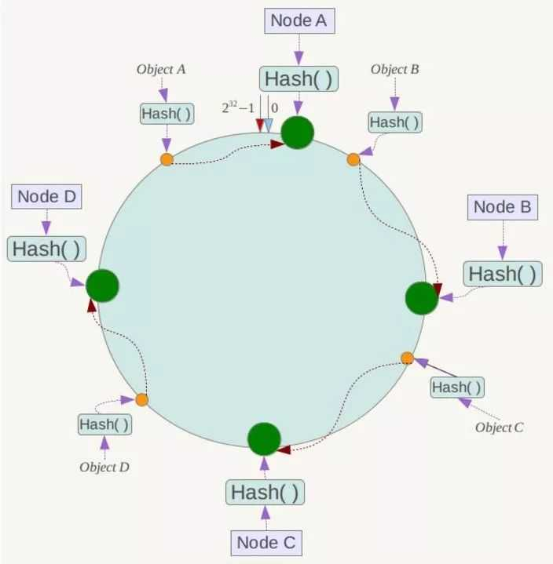

了解一致性HASH之前我们先来了解下取模算法

## 举个例子

我们通常用到的Redis缓存，如果数据量较少一台Redis就搞定了。但是数据量大了，或者为了高可用可能就需要多台了。如果我们现在有4台Redis那么我们怎么能让数据尽量存储平均呢？

最简单的办法就是：
**Hash(key) % N**，key是要存储的数据，N是Redis的数量，在这里N=4。

上面的方法看起来比较美好，但是一旦扩容就会遇到问题。假设说我们现在4台Redis不够用了要加一台那么我们的算法就变成了**Hash(key) % 5**；导致大部分key都会找不到。如果当前并发量比较大就会发生我们常说的**缓存雪崩**。

## 一致性HASH算法

一致性HASH算法可以很好的解决我们上面出现问题，原理也是用取模的方法，不过一致性HASH算法是对**2^32**取模，简单来说一致性HASH是将哈希值形成一个圆环，范围是 0 - 2^32；整个HASH环如下

下一步是将我们的服务器进行HASH在环上找到自己的位置（可以是服务器+端口后对2^32取模），假设总共有4台服务，在环上的位置如下：

接下来是如何让数据定位到具体的Node上。

假设我们有 A ，B ，C ，D四个数据对象经过HASH之后可能是环上的某一个定位但不是Node位置，那么怎么办呢，我们顺时针往下走遇到的第一个Node就是我们要存储的服务器，如下图所示：

如果增加或删除服务器只会影响**部分数据**

最后我们总结一致性HASH可以方便的增删服务并且只影响部分数据，注意：是解决了大部分数据问题，而不是所有。算是hash的增强。

## 扩展阅读

数据量少的情况下我们会遇到数据倾斜，需要加虚拟节点。需要的同学可以自行查询相关资料。