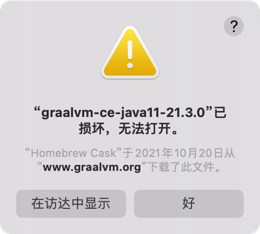

## 背景

提示:

> “graalvm-ce-java11-20.3.0” is damaged and can’t be opened.
> 
> 或
> 
> “graalvm-ce-java11-21.3.0”已损坏，无法打开。

## 如何解决

在 macOS Catalina 上，您可能会收到“无法验证开发人员”的警告。这是因为 GraalVM 尚未签名和认证。但是，可以在“安全和隐私”首选项窗格中或通过运行以下命令来禁用该检查：

```shell
xattr -r -d com.apple.quarantine /Library/Java/JavaVirtualMachines/graalvm-ce-javaV-XX.Y.Z
```

[官方解释和说明](https://github.com/graalvm/homebrew-tap#macos-catalina-specifics)