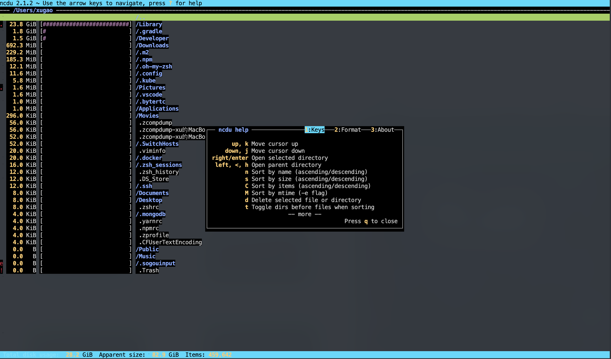

import Tabs from '@theme/Tabs';
import TabItem from '@theme/TabItem';
import CodeBlock from '@theme/CodeBlock';

## 简介

Ncdu 是一个带有 ncurses 接口的磁盘使用分析器。 它旨在在您没有可用的完整图形设置的远程服务器上查找空间占用者，但即使在常规桌面系统上它也是一个有用的工具。 Ncdu 的目标是快速、简单和易于使用，并且应该能够在安装了 ncurses 的任何最小的类似 POSIX 的环境中运行。

替代`du -h`等工具

## 安装

<Tabs>
  <TabItem value="apple" label="macOS" default>
    <CodeBlock language="shell">
      brew install ncdu
    </CodeBlock>
  </TabItem>
  <TabItem value="orange" label="ubuntu">
    <CodeBlock language="shell">
      apt-get install ncdu
    </CodeBlock>
  </TabItem>
  <TabItem value="banana" label="Centos">
    <CodeBlock language="shell">
      yum -y install ncdu
    </CodeBlock>
  </TabItem>
</Tabs>

## 使用

### 查看当前目录磁盘使用，直接：
```shell
ncdu
```

### 查看指定目录
```shell
ncdu /  #根目录，全盘
ncdu /home
```

## 快捷键

```
up, k 上移光标
down, j 向下移动光标
right/enter 打开选中目录
left, <, h 打开父目录
n 按名称排序（升序/降序）
s 按大小排序（升序/降序）
C 按项目排序（升序/降序）
M 按 mtime 排序（-e 标志）
d 删除选中的文件或目录
t 排序时切换文件前的目录
g 显示百分比和/或图表
u 显示/隐藏硬链接共享大小
a 外观大小和磁盘使用率之间的切换
c 切换显示子项计数
e 显示/隐藏隐藏或排除的文件
i 显示所选项目的信息
r 重新计算当前目录
b 在当前目录中生成 shell
q 退出ncdu
```
