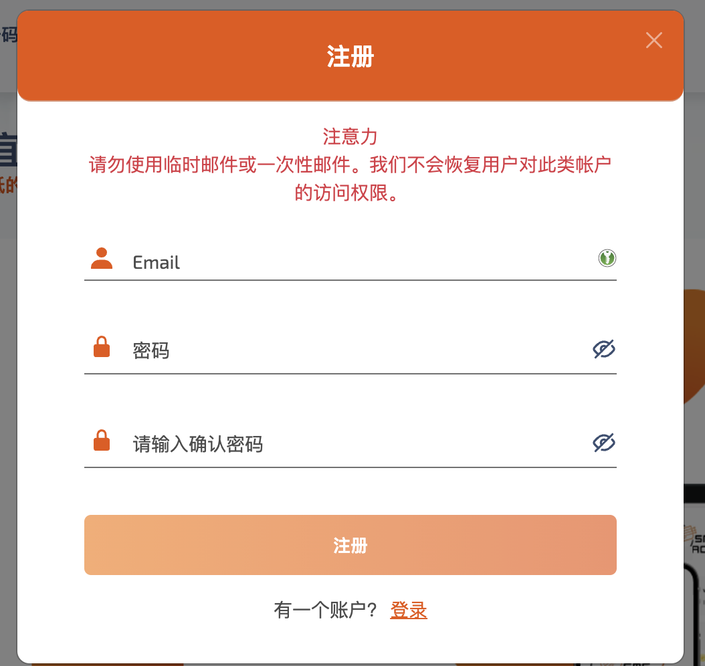
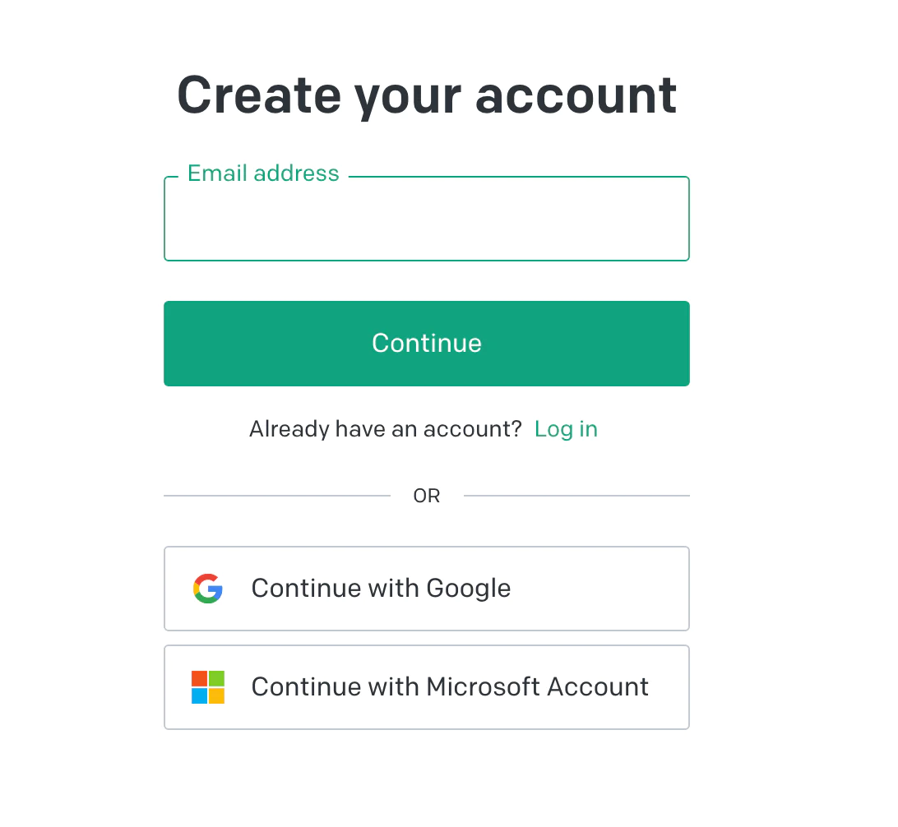

国内注册 **ChatGPT** 会出现提示 not available in your country 也就是你所在的国家无法注册  现在教你如何解决。

## 需要

1. 代理  注意不能是中国或香港，最好用 美国或者日本的
2. 需要一个国外的手机号， 我们通过在线短信平台接码来解决 [sms-activate.org](https://sms-activate.org/?ref=2684538) （需要充1美元）

## 开始

## 第一步 注册 **SMS-ACTIVATE 并充值**

打开 [sms-activate.org](https://sms-activate.org/?ref=2684538) ，注册帐号

充值

接收一次OpenAI的验证码成本大概在7~10卢布（人民币1块钱左右），平台只接受美金，所以我们充值1美金就够了 大概7人民币。

我们选择充值渠道 这里我选的支付宝

充值完毕之后我们先回到OpenAI的页面一会再回来操作

## 第二步 注册OpenAI

> **注意一定要挂代理访问 前面有提到**
>

我们打开[OpenAI的注册页面](https://beta.openai.com/signup)。 邮箱gmail或者国内的都可以。

填写完成之后点击Continue，然后会给你注册的邮箱发一个邮件 点击注册 填写基本信息。

### 填写手机号

截图里是韩国 我们要选择印度（India）。

回到我们接码的平台在左侧列表选择OpenAI服务 然后选择印度 **点击购物车**

跳转到此页面我们 **激活通过短信** 下会有你刚才加入购物车的手机号 我们复制粘贴到OpenAI注册页面等待**短信验证码**回填

填写完验证码之后 这个页面我们随便选一个选项就行

完成之后 我们就可以尽情体验**ChatGPT**了

