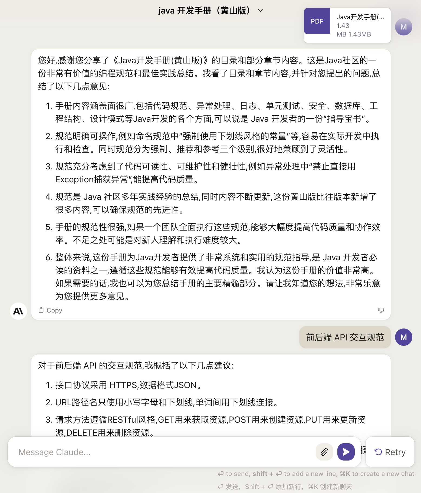

:::tip 转发

最近谷歌却被爆出大规模投资了另一家新兴AI创业公司Anthropic,其重点产品是Claude这个AI系统。Claude是一个强大的大型语言模型,在处理中文和上下文对话方面表现不俗,还拥有写作、编程、解释概念和翻译等多方面的应用潜力。与ChatGPT类似,Claude也值得关注,是AI领域一个有潜力的新尝试。

:::

## Claude 2.0 大更新

Claude 2.0 目前依然在免费试用阶段,已经从 Slack 平台独立出来,直接在官网使用。据部分使用者反馈, Claude 1.x 的水平已与 GPT 3.5 相近, Claude 2.0 在语言理解能力上有所进步,是一款值得关注的新兴 AI 系统。使用 Claude 2.0 无需支付费用,目前还有一定的使用限制,但对开发者也开放了 API 。普通用户可以上传文档等给 Claude 2.0 阅读分析,每次最多5个文件。 Claude 2.0 在语言理解方面的表现确实不错,有望成为一款实用的AI助手。

## Claude 2.0 注册教程
1. 必须准备好代理，美国最好
2. 前往「[Claude.ai 官网](https://Claude.ai/)」
3. 可用任意邮箱注册，需手工填写邮件验证码；或使用 Google 账号直接登录 (推荐后者更方便)
4. 按照流程一步一步确认信息后即可使用
5. 在聊天框内输入内容即可与 AI 聊天了，与 ChatGPT 网页版的使用基本一样

