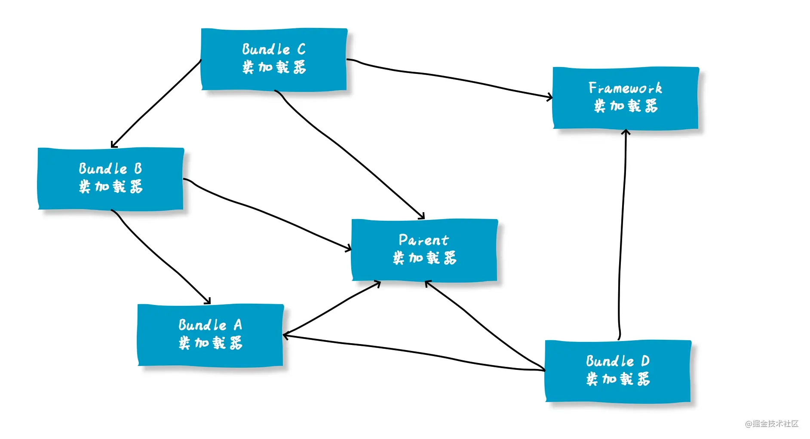

## 什么是双亲委派机制

首先，我们知道，虚拟机在加载类的过程中需要使用类加载器进行加载，而在 Java 中，类加载器有很多，那么当 JVM 想要加载一个 .class 文件的时候，到底应该由哪个类加载器加载呢？
这就不得不提到"双亲委派机制"。
首先，我们需要知道的是，Java 语言系统中支持以下4种类加载器：

- Bootstrap ClassLoader 启动类加载器
- Extention ClassLoader 标准扩展类加载器
- Application ClassLoader 应用类加载器
- User ClassLoader 用户自定义类加载器

这四种类加载器之间，是存在着一种层次关系的，如下图


一般认为上一层加载器是下一层加载器的父加载器，那么，除了 BootstrapClassLoader 之外，所有的加载器都是有父加载器的。

那么，所谓的双亲委派机制，指的就是：当一个类加载器收到了类加载的请求的时候，他不会直接去加载指定的类，而是把这个请求委托给自己的父加载器去加载。只有父加载器无法加载这个类的时候，才会由当前这个加载器来负责类的加载。
那么，什么情况下父加载器会无法加载某一个类呢？
其实，Java中提供的这四种类型的加载器，是有各自的职责的：

- Bootstrap ClassLoader ，主要负责加载Java核心类库，%JRE_HOME%\lib下的rt.jar、resources.jar、charsets.jar和class等。
- Extention ClassLoader，主要负责加载目录%JRE_HOME%\lib\ext目录下的jar包和class文件。
- Application ClassLoader ，主要负责加载当前应用的classpath下的所有类
- User ClassLoader ， 用户自定义的类加载器,可加载指定路径的class文件

那么也就是说，一个用户自定义的类，如 com.ga0x.Student 是无论如何也不会被 Bootstrap 和 Extention 加载器加载的。

## 为什么需要双亲委派？

如上面我们提到的，因为类加载器之间有严格的层次关系，那么也就使得Java类也随之具备了层次关系。

或者说这种层次关系是优先级。

比如一个定义在java.lang包下的类，因为它被存放在rt.jar之中，所以在被加载过程汇总，会被一直委托到Bootstrap ClassLoader，最终由Bootstrap ClassLoader所加载。

而一个用户自定义的 com.ga0x.Student 类，他也会被一直委托到Bootstrap ClassLoader，但是因为Bootstrap ClassLoader不负责加载该类，那么会在由Extention ClassLoader尝试加载，而Extention ClassLoader也不负责这个类的加载，最终才会被Application ClassLoader加载。

这种机制有几个好处。

首先，``通过委派的方式，可以避免类的重复加载``，当父加载器已经加载过某一个类时，子加载器就不会再重新加载这个类。

另外，``通过双亲委派的方式，还保证了安全性``。因为Bootstrap ClassLoader在加载的时候，只会加载JAVA_HOME中的jar包里面的类，如java.lang.Integer，那么这个类是不会被随意替换的，除非有人跑到你的机器上， 破坏你的JDK。

那么，就可以避免有人自定义一个有破坏功能的java.lang.Integer被加载。这样可以有效的防止核心Java API被篡改。

## "父子加载器"之间的关系是继承吗？

很多人看到父加载器、子加载器这样的名字，就会认为Java中的类加载器之间存在着继承关系。

甚至网上很多文章也会有类似的错误观点。

这里需要明确一下，``双亲委派模型中，类加载器之间的父子关系一般不会以继承（Inheritance）的关系来实现，而是都使用组合（Composition）关系来复用父加载器的代码的``。

如下为ClassLoader中父加载器的定义：

```java
public abstract class ClassLoader {
// The parent class loader for delegation
private final ClassLoader parent;
}
```

## 双亲委派是怎么实现的？

双亲委派模型对于保证Java程序的稳定运作很重要，但它的实现并不复杂。

实现双亲委派的代码都集中在java.lang.ClassLoader的loadClass()方法之中：

```java 
protected Class<?> loadClass(String name, boolean resolve)
        throws ClassNotFoundException
    {
        synchronized (getClassLoadingLock(name)) {
            // First, check if the class has already been loaded
            Class<?> c = findLoadedClass(name);
            if (c == null) {
                long t0 = System.nanoTime();
                try {
                    if (parent != null) {
                        c = parent.loadClass(name, false);
                    } else {
                        c = findBootstrapClassOrNull(name);
                    }
                } catch (ClassNotFoundException e) {
                    // ClassNotFoundException thrown if class not found
                    // from the non-null parent class loader
                }

                if (c == null) {
                    // If still not found, then invoke findClass in order
                    // to find the class.
                    long t1 = System.nanoTime();
                    c = findClass(name);

                    // this is the defining class loader; record the stats
                    sun.misc.PerfCounter.getParentDelegationTime().addTime(t1 - t0);
                    sun.misc.PerfCounter.getFindClassTime().addElapsedTimeFrom(t1);
                    sun.misc.PerfCounter.getFindClasses().increment();
                }
            }
            if (resolve) {
                resolveClass(c);
            }
            return c;
        }
    }
```

代码不难理解，主要就是以下几个步骤：

1. 先检查类是否已经被加载过 
2. 若没有加载则调用父加载器的loadClass()方法进行加载 
3. 若父加载器为空则默认使用启动类加载器作为父加载器。 
4. 如果父类加载失败，抛出ClassNotFoundException异常后，再调用自己的findClass()方法进行加载。

## 如何主动破坏双亲委派机制？

知道了双亲委派模型的实现，那么想要破坏双亲委派机制就很简单了。

因为他的双亲委派过程都是在 loadClass 方法中实现的，``那么想要破坏这种机制，那么就自定义一个类加载器，重写其中的 loadClass 方法，使其不进行双亲委派即可``。

## loadClass（）、findClass（）、defineClass（）区别

ClassLoader 中和类加载有关的方法有很多，前面提到了 loadClass ，除此之外，还有 findClass 和 defineClass 等，那么这几个方法有什么区别呢

- loadClass()
  - 就是主要进行类加载的方法，默认的双亲委派机制就实现在这个方法中。
- findClass()
  - 根据名称或位置加载.class字节码
- definclass()
  - 把字节码转化为Class

这里面需要展开讲一下 loadClass 和 findClass ，我们前面说过，当我们想要自定义一个类加载器的时候，并且像破坏双亲委派原则时，我们会重写 loadClass 方法。

那么，如果我们想定义一个类加载器，但是不想破坏双亲委派模型的时候呢？

这时候，就可以继承 ClassLoader，并且重写 findClass 方法。findClass() 方法是 JDK1.2 之后的 ClassLoader 新添加的一个方法。

```java 
 /**
 * @since  1.2
 */
protected Class<?> findClass(String name) throws ClassNotFoundException {
    throw new ClassNotFoundException(name);
}
```

这个方法只抛出了一个异常，没有默认实现。

JDK1.2 之后已不再提倡用户直接覆盖 loadClass() 方法，而是建议把自己的类加载逻辑实现到 findClass() 方法中。

因为在 loadClass() 方法的逻辑里，如果父类加载器加载失败，则会调用自己的 findClass() 方法来完成加载。

``所以，如果你想定义一个自己的类加载器，并且要遵守双亲委派模型，那么可以继承ClassLoader，并且在 findClass 中实现你自己的加载逻辑即可。``

## 双亲委派被破坏的例子

双亲委派机制的破坏不是什么稀奇的事情，很多框架、容器等都会破坏这种机制来实现某些功能。

**第一种是被破坏的情况是在双亲委派出现之前。**

由于双亲委派模型是在 JDK1.2 之后才被引入的，而在这之前已经有用户自定义类加载器在用了。所以，这些是没有遵守双亲委派原则的。

**第二种是JNDI、JDBC等需要加载SPI接口实现类的情况。**

**第三种是为了实现热插拔热部署工具。为了让代码动态生效而无需重启，实现方式时把模块连同类加载器一起换掉就实现了代码的热替换。**

**第四种是tomcat等web容器的出现。**

**第五种是OSGI、Jigsaw等模块化技术的应用。**

## 为什么JNDI，JDBC等需要破坏双亲委派？

我们日常开发中，大多数时候会通过API的方式调用Java提供的那些基础类，这些基础类时被Bootstrap加载的。

但是，调用方式除了API之外，还有一种SPI的方式。

如典型的JDBC服务，我们通常通过以下方式创建数据库连接：

```java 
Connection conn = DriverManager.getConnection("jdbc:mysql://localhost:3306/mysql", "root", "1234");
```

在以上代码执行之前，DriverManager会先被类加载器加载，因为java.sql.DriverManager类是位于rt.jar下面的 ，所以他会被根加载器加载。

类加载时，会执行该类的静态方法。其中有一段关键的代码是：

```java 
ServiceLoader<Driver> loadedDrivers = ServiceLoader.load(Driver.class);
```

这段代码，会尝试加载classpath下面的所有实现了Driver接口的实现类。

那么，问题就来了。

``DriverManager 是被根加载器加载的，那么在加载时遇到以上代码，会尝试加载所有 Driver 的实现类，但是这些实现类基本都是第三方提供的，根据双亲委派原则，第三方的类不能被根加载器加载。``

那么，怎么解决这个问题呢？

于是，就在``JDBC中通过引入 ThreadContextClassLoader（线程上下文加载器，默认情况下是 AppClassLoader）的方式破坏了双亲委派原则``。

我们深入到ServiceLoader.load方法就可以看到：

```java
public static <S> ServiceLoader<S> load(Class<S> service) {
ClassLoader cl = Thread.currentThread().getContextClassLoader();
return ServiceLoader.load(service, cl);
}
```

第一行，获取当前线程的线程上下⽂类加载器 AppClassLoader，⽤于加载 classpath 中的具体实现类。

## 为什么Tomcat要破坏双亲委派

我们知道，Tomcat是web容器，那么一个web容器可能需要部署多个应用程序。

不同的应用程序可能会依赖同一个第三方类库的不同版本，但是不同版本的类库中某一个类的全路径名可能是一样的。

如多个应用都要依赖hollis.jar，但是A应用需要依赖1.0.0版本，但是B应用需要依赖1.0.1版本。这两个版本中都有一个类是com.hollis.Test.class。

``如果采用默认的双亲委派类加载机制，那么是无法加载多个相同的类``。

所以，``Tomcat破坏双亲委派原则，提供隔离的机制，为每个web容器单独提供一个WebAppClassLoader加载器``。

Tomcat的类加载机制：为了实现隔离性，优先加载 Web 应用自己定义的类，所以没有遵照双亲委派的约定，每一个应用自己的类加载器——WebAppClassLoader负责加载本身的目录下的class文件，加载不到时再交给CommonClassLoader加载，这和双亲委派刚好相反。

## 模块化技术与类加载机制

近几年模块化技术已经很成熟了，在JDK 9中已经应用了模块化的技术。

其实早在JDK 9之前，OSGI这种框架已经是模块化的了，``而OSGI之所以能够实现模块热插拔和模块内部可见性的精准控制都归结于其特殊的类加载机制，加载器之间的关系不再是双亲委派模型的树状结构，而是发展成复杂的网状结构``。



``在JDK中，双亲委派也不是绝对的了。``

在JDK9之前，JVM的基础类以前都是在rt.jar这个包里，这个包也是JRE运行的基石。

这不仅是违反了单一职责原则，同样程序在编译的时候会将很多无用的类也一并打包，造成臃肿。

``在JDK9中，整个JDK都基于模块化进行构建，以前的rt.jar, tool.jar被拆分成数十个模块，编译的时候只编译实际用到的模块，同时各个类加载器各司其职，只加载自己负责的模块。``

```java
Class<?> c = findLoadedClass(cn);
if (c == null) {
    // 找到当前类属于哪个模块
    LoadedModule loadedModule = findLoadedModule(cn);
    if (loadedModule != null) {
        //获取当前模块的类加载器
        BuiltinClassLoader loader = loadedModule.loader();
        //进行类加载
        c = findClassInModuleOrNull(loadedModule, cn);
     } else {
          // 找不到模块信息才会进行双亲委派
            if (parent != null) {
              c = parent.loadClassOrNull(cn);
            }
      }
}
```