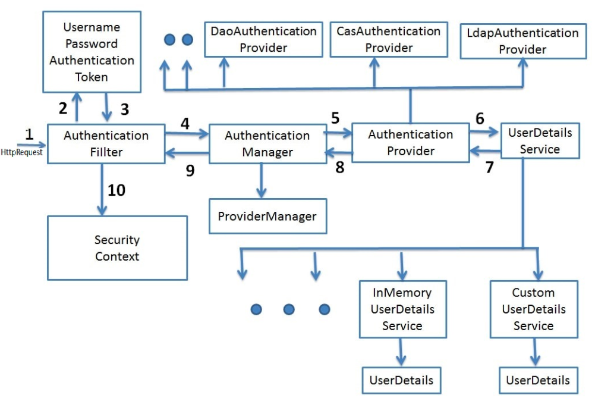
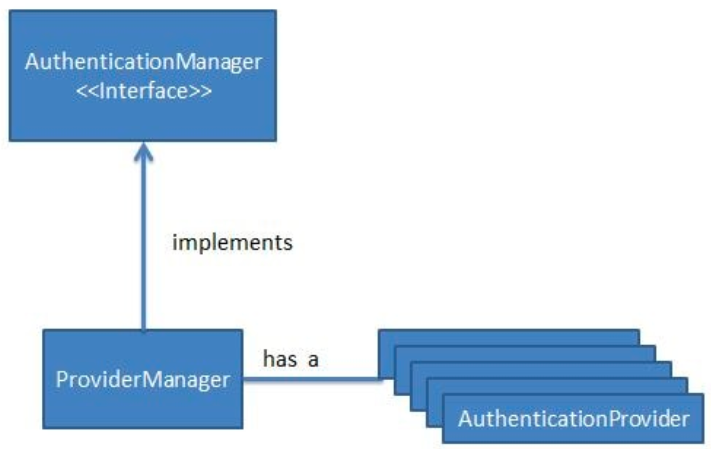
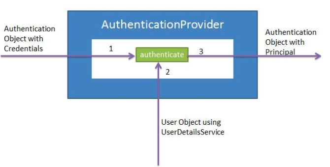

> AuthenticationManager 和 AuthenticationProvider 都是接口。它们在 Spring Security Flow 中具有不同的功能。

## Spring Boot + Spring Security 架构

- **AuthenticationManager** - 当用户尝试访问应用程序时，http 请求被过滤器/过滤器链拦截。使用创建的身份验证对象，过滤器将调用身份验证管理器的身份验证方法。Authentication Manager 只是一个接口，authenticate 方法的实际实现由 ProviderManager 提供。ProviderManager 有一个 AuthenticationProviders 列表。它从它的身份验证方法调用适当的 AuthenticateProvider 的身份验证方法。作为响应，如果身份验证成功，它将获取主体身份验证对象。

- **AuthenticationProvider -** AuthenicationProvider 是一个带有认证和支持方法的接口。它有各种实现，例如 CasAuthenticationProvider 或 DaoAuthenticationProvider。根据实现，使用适当的 AuthenicationProvider 实现。它在 AuthenticationProvider 实现的 authenticate 方法中进行所有实际的身份验证。

