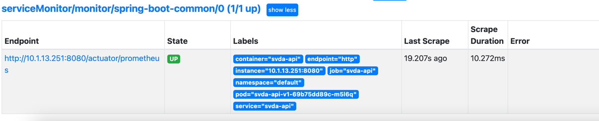
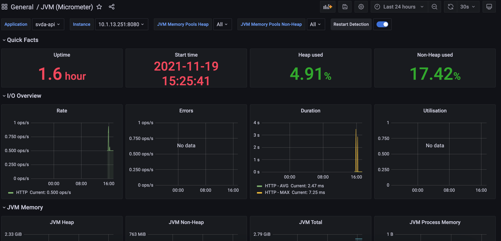

## 环境

:::tip

kubernetes

helm: 3

kube-prometheus-stack: 集成 Grafana 并且符合k8s的 prometheus 堆

spring boot: 2.5.5

java: 11

:::

## helm 安装 kube-prometheus-stack

```shell
helm repo add prometheus-community https://prometheus-community.github.io/helm-charts
helm repo update
# 安装在monitoring空间下 记得改 [RELEASE_NAME]
helm install [RELEASE_NAME] -n monitoring prometheus-community/kube-prometheus-stack
```

### 包含组件
| 序号   | 组件  | 介绍  |
|  ----  | ----  | ----  |
|   1    | Prometheus Operator |    Prometheus Operator 提供Kubernetes原生部署和管理 Prometheus及相关监控组件。该项目的目的是简化和自动化基于 Prometheus 的 Kubernetes 集群监控堆栈的配置。   |
|   2    | 高可用的 Prometheus |    时序数据   |
|   3    | 高可用的 Alertmanager |    报警服务   |
|   3    | Prometheus node-exporter |  负责收集集群主机关键指标     |
|   3    | Prometheus Adapter for Kubernetes Metrics APIs |    Kubernetes 资源指标、 自定义指标和 外部指标API 的实现（适用于 k8s 发现注册 Prometheus 的关键实现）   |
|   3    | kube-state-metrics |    监听 Kubernetes API 服务器并生成关于对象状态的指标   |
|   3    | Grafana |    一款开源数据可视化面板（监控和数据统计）   |

访问我们刚部署的服务

```shell
kubectl port-forward -n monitoring service/prometheus-kube-prometheus-prometheus 9090
kubectl port-forward -n monitoring service/prometheus-grafana 8080:80
```

我们访问 Prometheus UI 和 Grafana UI。分别访问http://localhost:9090、http://locahost:8080。grafana 的凭据是username: admin& password: prom-operator。我们也可以从 k8s secrets 中获取密码或者安装时指定 helm的values变量来自定义密码。

## 添加符合 prometheus 格式输出的指标（以 Java Spring Boot2 应用示例）

```groovy title="build.gradle"
dependencies {
	implementation 'org.springframework.boot:spring-boot-starter-actuator'
	implementation 'org.springframework.boot:spring-boot-starter-web'

	implementation 'io.micrometer:micrometer-registry-prometheus'
}
```

```yaml title="application.yml"
management:
  endpoints:
    web:
      exposure:
        include: '*'
  metrics:
    tags:
      application: ${spring.application.name}
    enable:
      all: true
```

此时访问应用`/actuator/metrics`地址时我们会看到 `prometheus` 格式的指标代表配置成功，格式如下：

>  ` <metric name>{<label name>=<label value>, ...} <metric_value>` 

## 部署应用

:::info
以下配置文件为简化版本，生产环境肯定不止如此，请大家根据自己的服务微调
:::

```yaml title="deployment.yaml"
apiVersion: apps/v1
kind: Deployment
metadata:
  name: spring-boot-monitor-demo-v1
  namespace: prod
  labels:
    app: spring-boot-monitor-demo
    version: v1
spec:
  selector:
    matchLabels:
      app: spring-boot-monitor-demo
      version: v1
  replicas: 2
  template:
    metadata:
      labels:
        app: spring-boot-monitor-demo
        version: v1
    spec:
      containers:
        - name: spring-boot-monitor-demo
          image: demo/spring-boot-monitor-demo:v1.0
          imagePullPolicy: IfNotPresent
          ports:
            - name: http
              containerPort: 8080
```

```yaml title="service.yaml"
apiVersion: v1
kind: Service
metadata:
  name: spring-boot-monitor-demo
  namespace: prod
  labels:
    app: spring-boot-monitor-demo
    service: spring-boot-monitor-demo
    monitor: prometheus # 关键～～～
spec:
  selector:
    app: spring-boot-monitor-demo
  ports:
    - protocol: TCP
      port: 8080
      targetPort: 8080
      name: http 
```

## 收集指标

:::info
此处为核心部分，来告诉 prometheus 捕捉我们应用程序 `/actuator/prometheus` 的关键指标
:::

prometheus 堆栈的 helm 安装创建了一些 CRD。其中之一是服务监视器(上面介绍到的Prometheus Adapter for Kubernetes Metrics APIs)。服务监视器是我们声明从哪个服务抓取指标和间隔的地方。与其他 k8s 资源一样，它也适用于匹配标签。
一件重要的事情是监控命名空间中的 prometheus 对象在我们拥有标签之前不会知道这个服务监视器 release: prometheus。如果我们描述prometheus resource。kubectl describe prometheuses.monitoring.coreos.com -n monitoring我们会发现它与此标签上的服务监视器相匹配。

```yaml
  Service Monitor Selector:
    Match Labels:
      Release:  prometheus
```

在monitoring命名空间中创建以下服务监控器。
```yaml
# spring boot 标准通用监控
apiVersion: monitoring.coreos.com/v1
kind: ServiceMonitor
metadata:
  name: spring-boot-common
  namespace: monitoring # namespace固定，不要修改
  labels:
    release: prometheus
spec:
  endpoints:
    - interval: 30s
      port: http
      path: /actuator/prometheus  # 填写Prometheus Exporter对应的Path的值，不填默认/metrics
  namespaceSelector:  # 选择要监控service所在的namespace
    matchNames:
      - prod
  selector: # 填写要监控service的Label值，以定位目标service
    matchLabels:
      monitor: prometheus
```
在prometheus控制台服务发现中，我们应该可以看到我们的目标服务spring-boot-monitor-demo(如果Deployment中配置多个实例同样会有多行信息展示)


## Grafana

在Grafana UI中添加 Dashboards 模板ID为 [4701](https://grafana.com/grafana/dashboards/4701) 查看我们的成果。


## 附录

### Prometheus Push Gateway with Micrometer
除本文方法之外还有另一种方法可以把关键指标推送给Prometheus，不过不建议 [原因参考](https://prometheus.io/docs/practices/pushing/#should-i-be-using-the-pushgateway)

## 参考链接

1. [Monitoring applications in K8s with Prometheus](https://iamonkar.dev/prometheus-k8s/)
2. [Prometheus 监控服务 - Spring Boot 接入](https://cloud.tencent.com/document/product/1416/56031)
3. [micrometer官方文档](https://micrometer.io/docs)
4. [micrometer官方文档](https://dbaplus.cn/news-134-3247-1.html)